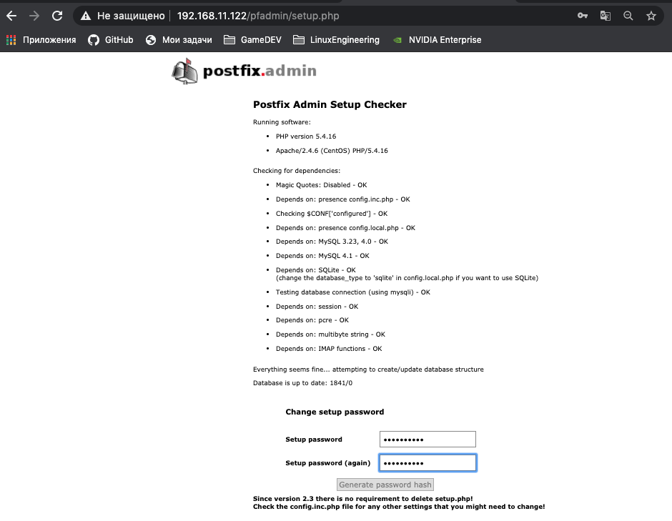
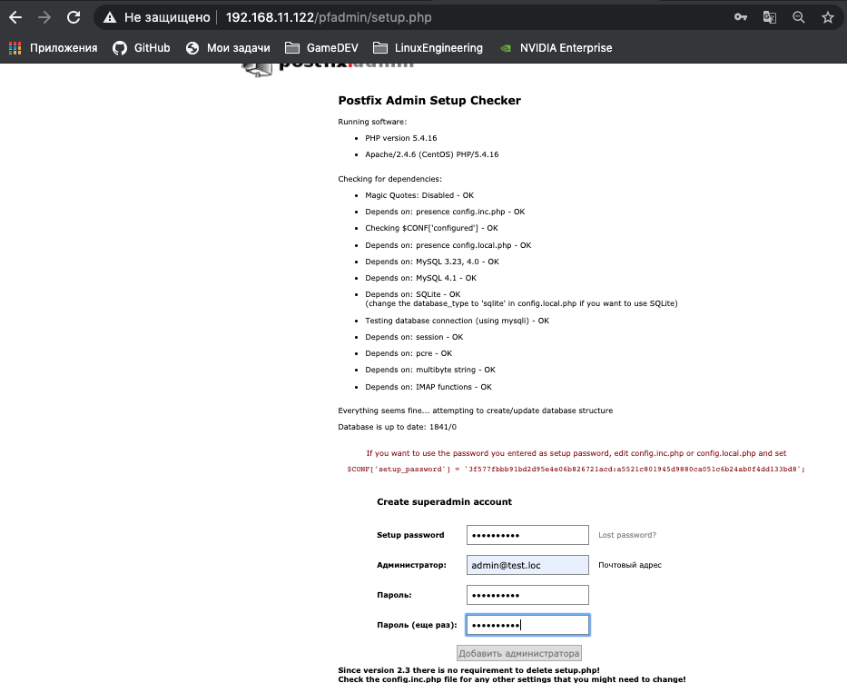
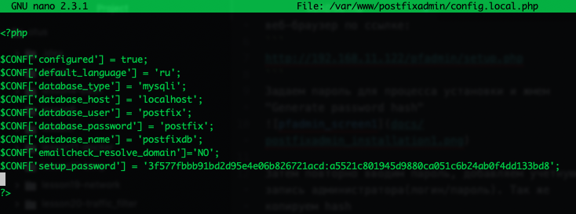
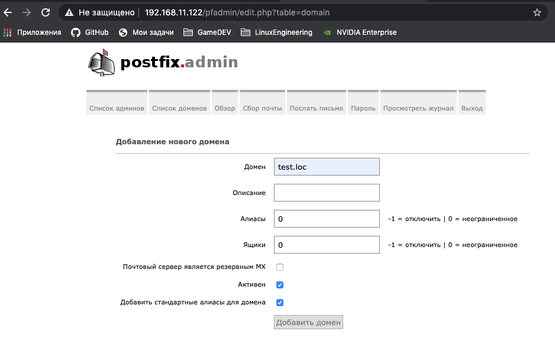
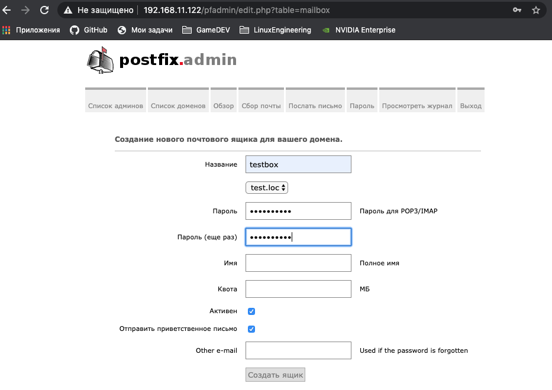
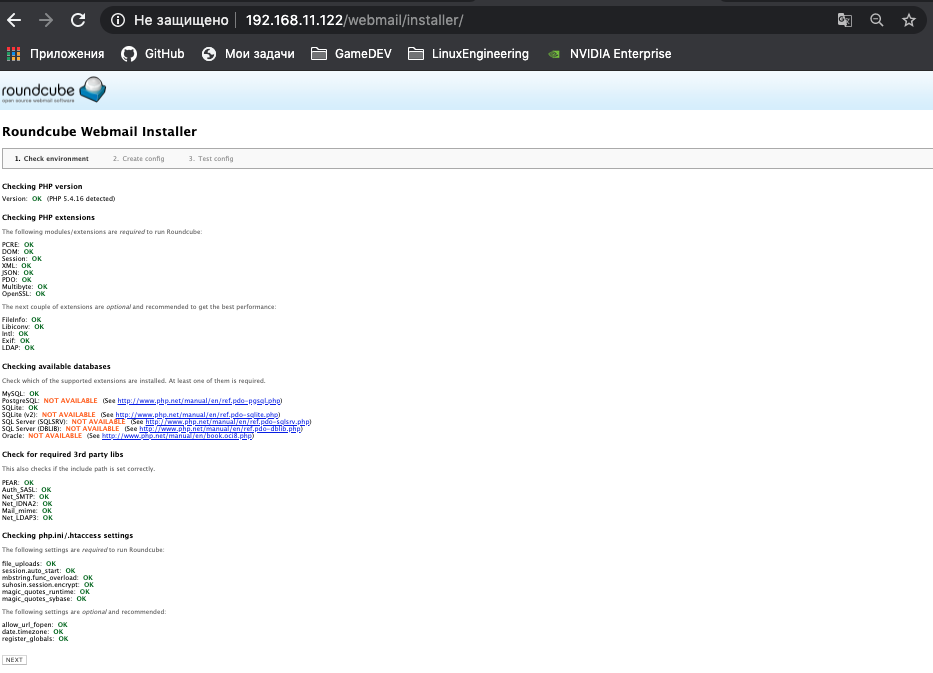
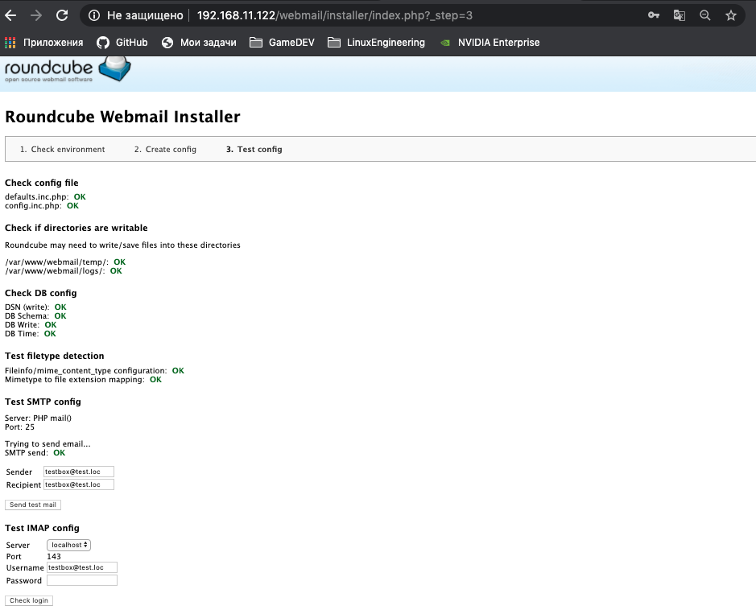
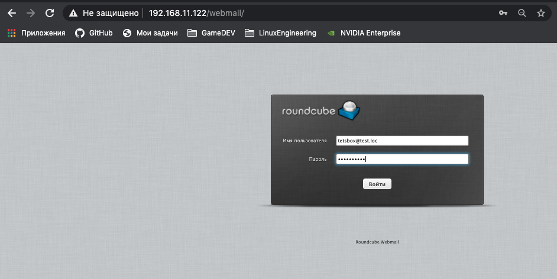
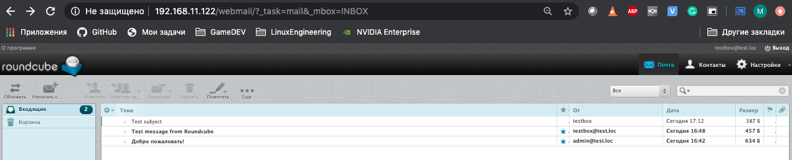
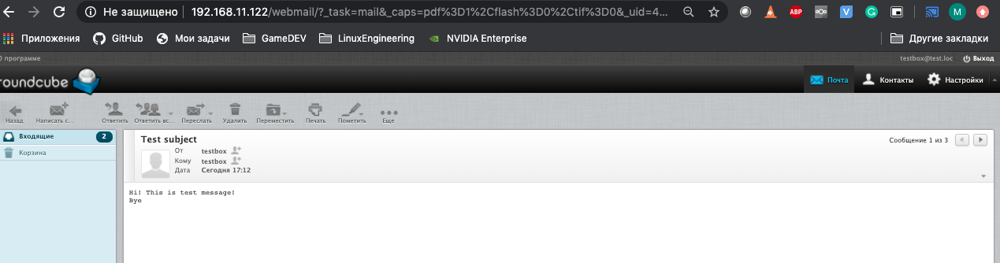

Для подготовки стэнда запускаем:
```bash
vagrant up && ansible-playbook playbooks/postfix+dovecot.yml
```
После того как сценарий закончит работу, для завершения установки postfixadmin, заходим через веб-браузер по ссылке:  
```
http://192.168.11.122/pfadmin/setup.php
```
Задаем пароль для процесса установки и жмем "Generate password hash"


Затем повторно вводим пароль, добавляем учетную запись администратора(логин/пароль). Так же копируем hash

```
$CONF['setup_password'] = '3f57...bd8';
```



И добавляем его в конфиг файл postfixadmin(/var/www/postfixadmin/config.local.php)



Нажимаем кнопку "Добавить администратор"  
Затем переходим по ссылки что бы авторизоваться. После чего вводим логин пароль.
```
http://192.168.11.122/pfadmin/login.php
```

Теперь необходимо добавить домен и создать почтовый ящик.
Для создания домена необходимо перейти в меню Список доменов -> Новый домен, вводим данные и нажимаем кнопку "Добавить домен"



Для создания пользователя переходим на вкладку Обзор -> Создать ящик, вводим даные и нажимаем кнопку "Создать ящик"



Следующий шаг, установка Roundcube, переходим по ссылки
```
http://192.168.11.122/webmail/installer/
```
Проверяем что все расширения установлены и жмем "Next"

На следующей странице так же проверяем все настройки нажимаем "Create config", затем "Continue


На последней странице можно отправить тестовое для проверки, а так же проверить соединение IMAP.

Для завершения установки необходимо добавить в конфиг файл /var/www/webmail/config/config.inc.php
```
$config['enable_installer'] = false;
```
И удалить папку с установочными скриптами

```bash
rm -rf /var/www/webmail/installer
```

Для проверки работы почтового сервера запускаем отправим почту при помощи telnet с основного хоста
```bash
telnet 192.168.11.122 25
Trying 192.168.11.122...
Connected to 192.168.11.122.
Escape character is '^]'.
220 mail.test.loc ESMTP Postfix
EHLO mail.test.loc
250-mail.test.loc
250-PIPELINING
250-SIZE 10240000
250-VRFY
250-ETRN
250-STARTTLS
250-ENHANCEDSTATUSCODES
250-8BITMIME
250 DSN
mail from: <testbox@test.loc>
250 2.1.0 Ok
rcpt to: <testbox@test.loc>
250 2.1.5 Ok
DATA
354 End data with <CR><LF>.<CR><LF>
From: testbox <testbox@test.loc>
To: testbox <testbox@test.loc>
Subject: Test subject
Content-Type: text/plain
Hi! This is test message!
Bye
.
250 2.0.0 Ok: queued as 45D668CA21
quit
221 2.0.0 Bye
Connection closed by foreign host.
```
Заходим через браузер на почтовый веб-клиент и вводим логин/пароль
```
http://192.168.11.122/webmail/
```


И видим 3 новых сообщения.

1. Пришло после создания почтового ящика с postfixadmin
2. Тестовое письмо которое было отправлено при установки Roundcube
3. Письмо которое отправили через telnet с основного хоста


